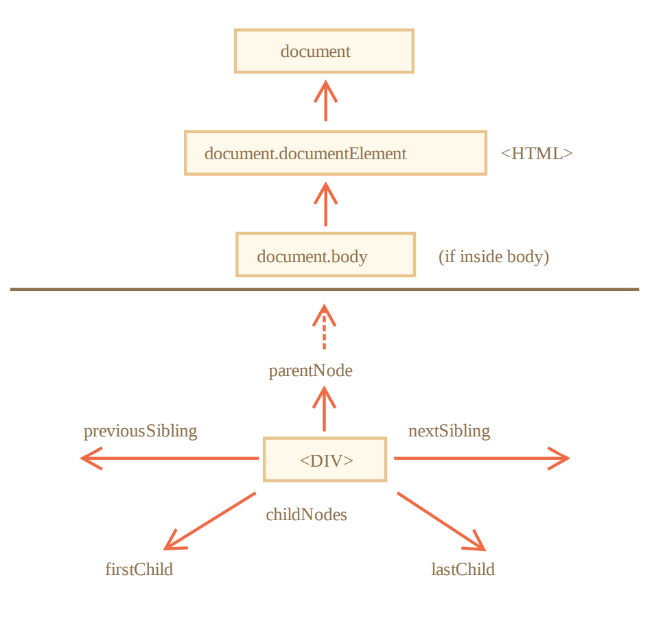
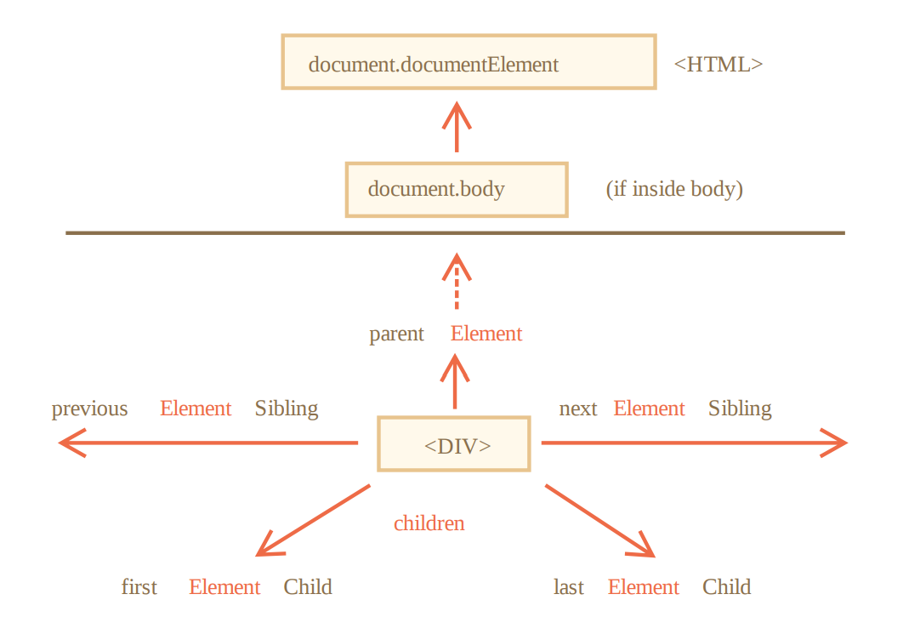
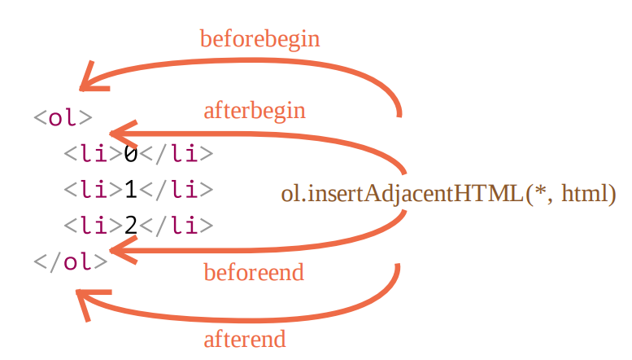
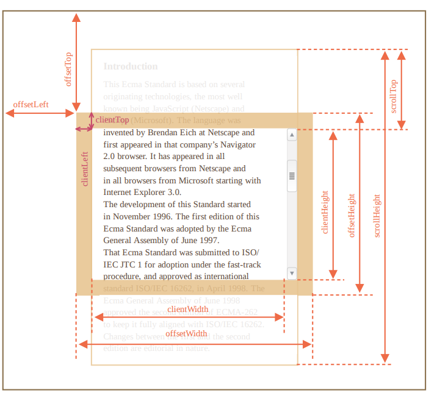
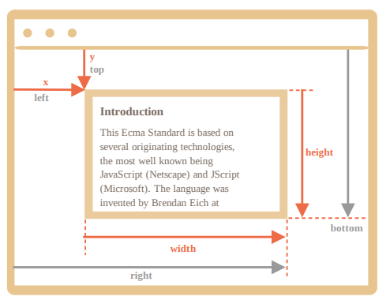

## 浏览器环境和规格

在浏览器中，window有两种角色

- Javascript代码的全局对象
- 代表浏览器窗口，并提供控制它的方法

document 对象是页面的主要“入口点”。我们可以使用它来更改或创建页面上的任何内容。

<!--more-->

## DOM树

每个树的节点都是一个对象，一共12种，通常用到4种

- document——DOM的入口点
- 元素节点——HTML标签，并形成文档结构
- 文本节点
- 注释

## 遍历DOM

### 对象间链接

> 对所有节点，是包含元素节点，文本节点，注释等

顶层树节点可以直接获取

- `document.documentElement`——`<html>`
- `document.body`
- `document.head`

两个术语

- 子节点——直系的子元素
  - childNodes列出**所有**子节点，**包括文本节点**
    - 返回的不是数组，而是集合，一个类数组的可迭代对象，可以用Array.from方法用它来创建一个”真“数组，使得能使用数组的方法
    - DOM集合是只读的，
    - 是实时的——例如先取得`elem.childNodes`的引用，而后修改DOM，那么节点的更新会自动出现在集合中
  - firstChild访问第一个子元素
  - lastChild访问最后一个子元素
- 子孙元素——嵌套在给定元素中所有的元素

兄弟节点

- nextSibling下一个兄弟节点
- previousSibling上一个兄弟节点

父节点

- parentNode

### 元素节点导航链接

- children——元素节点的子代的节点
- firstElementChild
- lastElementChild
- previousElementSibling
- nextElementSibling
- parentElement

### 表格

- table.rows——`<tr>`元素的**集合**
  - tr.cells
    - 给定`<tr>`中的`<td>`和`<th>`单元格的集合
  - tr.sectionRowIndex
    - 给定的`<tr>`在封闭的`<thead>/<tbody>/<tfoot>`中的位置（索引）。
  - tr.rowIndex
    - 整个表格`<tr>`的编号
- table.caption
- table.tHead
- table.tFoot
- table.tBodies——`<tbody>`元素的集合
- `<td>`和`<th>`
  - td.cellIndex在封闭的`<tr>`中单元格的编号

## 搜索

1. getElement*
   - document.getElementById(id)
2. querySelector*
   - elem.querySelectorAll(CSS)
     - 返回 elem 中与给定 CSS 选择器匹配的**所有**元素
     - 静态集合，像固定的数组
   - elem.querySelector(CSS)
     - 返回给定 CSS 选择器的**第一个**元素
3. elem.matches(CSS)
   - 检查 elem 是否与给定的 CSS 选择器匹配。它返回 true 或 false
4. elem.closest(CSS)
   - 查找与 CSS 选择器匹配的**最近的祖先**
5. “getElementsBy*”方法，返回的都是**实时的集合**，始终反映的是文档的当前状态
   - elem.getElementsByTagName(tag)
   - elem.getElementsByClassName(className)
   - document.getElementsByName(name)
6. elemA.contains(elemB)
   - elemB 在 elemA 内或者 elemA==elemB就返回true

## 节点属性

- innerHTML
  - 仅对元素节点有效
    - 文本节点、注释节点用`data`属性获取内容
  - += 是会重写，先抹除原先内容，再把原先内容和附加内容结合，赋值过去
    - 因此所有的图片和其他资源都将重写加载
- outerHTML
  - 写入 outerHTML 不会改变元素。而是在 DOM 中替换它
    - 写入后，DOM会显示新写入的，但打印出来却是旧的值
  - outerHTML 赋值不会修改 DOM 元素，而是将其从 DOM 中删除并在其位置插入新的 HTML。
- textContent
  - 只返回文本，就像所有`tag`都被剪掉了一样
  - 写入比innerHTML安全一些，因为，innerHTML写入的内容会作为html插入，而textContent只当成文本插入
- hidden
  - 设置为true与CSS中，`display: none`做着相同的事情

大多数标准 HTML 特性（attribute）都具有相应的 DOM 属性。

## 特性(写在 HTML 中的内容)和属性( DOM 对象中的内容)

> 当浏览器加载页面时，它会“读取”（或者称之为：“解析”）HTML 并从中生成 DOM 对象。对于元素节点，大多数标准的 HTML 特性（attributes）会自动变成 DOM 对象的属性（properties）
>
> 但特性—属性映射并不是一一对应的

### DOM属性

DOM节点是常规的Javascript的对象

- 大小写敏感
- 可以设多种值

## HTML特性

- 当浏览器解析 HTML 文本，并根据标签创建 DOM 对象时，浏览器会辨别**标准的**特性并以此创建 DOM 属性。而**非标准的**就没有相对应的 DOM 属性，会变成了`undefined`
- 大小写不敏感
- 值总是字符串类型

所有特性（标准的非标准的）都可以通过使用以下方法进行访问：

- elem.hasAttribute(name) — 检查特性是否存在
- elem.getAttribute(name) — 获取这个特性值
- elem.setAttribute(name, value) — 设置这个特性值
- elem.removeAttribute(name) — 移除这个特性。

### 属性-特性同步

当一个标准的特性被改变，对应的属性也会自动更新，（除了几个特例）反之亦然

- 例外：如`input.value`只能从特性同步到属性

### 非标准特性dataset

>非标准的特性常常用于将自定义的数据从 HTML 传递到 JavaScript，或者用于为 JavaScript “标记” HTML 元素

为了避免冲突，所有以 `data-` 开头的特性均被保留供程序员使用。它们可在 dataset 属性中使用。

用法：

- 如果一个 elem 有一个名为 `data-about` 的特性，那么可以通过 `elem.dataset.about` 取到它
- 多词特性可以以驼峰式进行调用

## 修改文档

### 创建一个元素

- `document.createElement(tag)`
  - 元素节点
- `document.createTextNode(text)`
  - 文本节点

### 添加类

- className

### 填充消息

- innerHTML

### 插入方法

字符串被以一种安全的方式插入到页面中，就像 `elem.textContent `所做的一样——不会被当成html插入，只当成文本

- node.append(nodes or strings)
  - 在 node **末尾**插入节点或字符串
- node.prepend()
  - 在node**开头**插入节点或字符串
- node.before()
  - 在node**前面**插入节点或字符串
- node.after()
  - 在node**后面**插入节点或字符串
- node.replaceWIth()
  - 将node替换给定的节点或字符串

- elem.insertAdjacentHTML(where, html) 

  - 内容作为 HTML 代码插入，如同innerHTML
  - where如下面的值

  

### 节点移除

- node.remove()

### 克隆节点

- cloneNode(true/false)
  - true为深克隆，具有所有特性 （attribute）和子元素
  - false，则不克隆子元素

### DocumentFragment

可以理解为容器

## 样式和类

### className

它将替换类中的整个字符串

### classList

可迭代

方法

- add()
  - 添加一个类
- remove()
  - 移除一个类
- toggle()
  - 如果类不存在就添加类，存在就移除它

### 重置样式属性

设为空字符

`elem.style.* = ""`

使用 style.* 来对各个样式属性进行赋值时，需要有单位，且不能一下子设置所有属性，因为 div.style 是一个对象，并且它是只读的，设置完整属性可用`style.cssText`

### 计算样式getComputedStyle

`getComputedStyle(element, [pseudo])`

- element 
  - 需要被读取样式值的元素
- pseudo 
  - 伪元素（如果需要），例如 ::before 。空字符串或无参数则意味着元素本身。

## 元素大小和滚动

几何属性，这些属性的值在技术上讲是数字，但这些数字其实是“像素（pixel）”

- offsetParent 是最接近的祖先
  - 最近祖先为下列之一
    - CSS 定位的（ position 为 absolute ， relative 或 fixed ）
    - 或`<td>,<th>,<table>`
    - 或`<body>`
  - 值有可能为null
    - 未显示的元素（ display:none 或者不在文档中）
    - 对于`<body>,<html>`
    - 对于带有position：fixed元素
- 属性 offsetLeft/offsetTop 提供相对于 offsetParent 左上角的 x/y 坐标
- offsetWidth/offsetHeight 是完整边框
  - content width/height + 2个padding width/height + 2个margin width/height
- 对于未显示的元素，几何属性为 0/null
  - 用几何属性来检查一个元素是否被隐藏
- clientTop
  - 上边框宽度
- clientLeft
  - 左边框宽度
- clientWidth/clientHeight
  - 元素边框内区域的大小——content width/height + 2个 padding width/height
- scrollWidth/scrollHeight
  - 就像 clientWidth/clientHeight ，但它们还包括滚动出（隐藏）的部分
- scrollLeft/scrollTop
  - 是元素的隐藏、滚动部分的 width/height

### 使用几何属性的原因

1. 首先，CSS width/height 取决于另一个属性： box-sizing ，它定义了“什么是” CSS 宽度和高度。出于 CSS 的目的而对 box-sizing 进行的更改可能会破坏 此类 JavaScript 操作。
2. 其次，CSS 的 width/height 可能是 auto ，例如内联（inline）元素。但在 JavaScript 中，我们需要 一个确切的 px 大小，以便我们在计算中使用它。

## Window大小和滚动

使用 document.documentElement 的 clientWidth/clientHeight返回文档可见部分，这个值不包括滚动条。

### 获得当前滚动

- scrollLeft/scrollTop 

### 调整滚动位置

- 方法 scrollBy(x,y) 将页面滚动至 相对于当前位置的 (x, y) 位置
- 方法 scrollTo(pageX,pageY) 将页面滚动至绝对坐标，使得可见部分的左上角具有相对于文档左上角的坐标 (pageX, pageY) 。就像设置了 scrollLeft/scrollTop 一样。

### 禁止滚动

设置overflow：hidden

## 坐标

### 元素坐标 getBoundingClinetRect()

页面上的任何点都有坐标：

- 相对于窗口的坐标 — elem.getBoundingClientRect() 。
- 相对于文档的坐标 — elem.getBoundingClientRect() 加上当前页面滚动。
