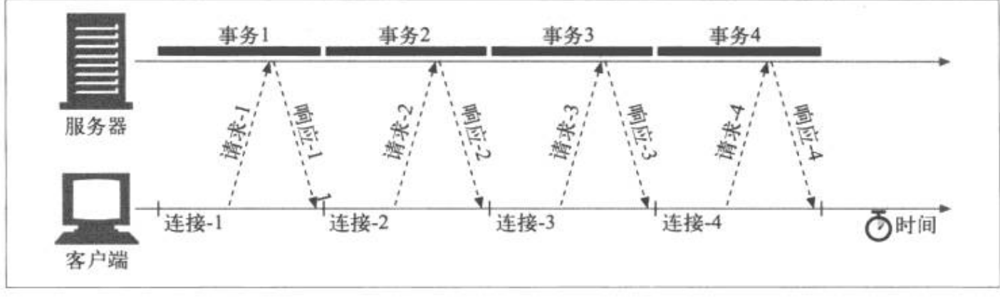

## HTTP介绍

### http是什么，用来做什么的

是数据传输协议。Web浏览器、服务器和相关Web应用程序都是通过http相互通信的

### Web客户端、服务端

发送请求的一般称为客户端，响应请求的一般称为服务端。HTTP客户端和HTTP服务端共同构成了万维网的基本组件

<!--more-->

### 什么是资源

网络上一切内容都是资源。Web服务器是Web资源的宿主，Web资源是Web内容的源头

### 什么是媒体类型

是用来描述并标记多媒体内容，用来告诉接收端，接收到的数据是什么类型，让接收端知道怎么才能处理该文件。HTTP给每种通过Web传输的对象都打上MIME类型的数据格式标签，例如`Content-type: text/html`

### URI

统一资源标识符，有两种形式：URL和URN，用于唯一识别和定位信息资源

#### URL

统一资源定位符，用来描述一台特服务器上某资源的特定位置。格式：协议（如http）+服务器地址（主机地址）+ 指定服务器上的某个资源

#### URN

统一资源名，用资源名定位资源，与位置无关

### 事务

​	就是一个http连接，一个http事务由一条请求命令和一条响应结果组成，通过http报文的格式化数据块进行

#### 方法

请求命令称为http方法，方法就是告诉服务器要做什么。常用方法：

- GET
- PUT
- DELETE
- POST
- HEAD

#### 状态码

用来告知客户端请求是否成功，或者是否需要采取其他动作。每条http响应报文返回时都会带有状态码，并附带解释性原因短语

### 报文

http报文是纯文本，不是二进制，分为请求报文和响应报文，包含三个结构

- 起始行
  - 说明用来做说明
  - 说明出现了说明情况
  - 格式
    - 命令 + 资源位置 + 协议版本
    - 协议版本 + 状态码 + 原因短语
- 首部字段
- 主体
  - 包含所有类型的数据，如二进制数据也是可以
  - 请求报文：发给Web服务器的数据
  - 响应报文：装载发给客户端的数据

### 连接

报文是通过TCP连接从一个地方到另一个地方，且TCP提供了无差错的数据传输、按序传输、未分段的数据流，所以报文传输是可靠的、按序的。

#### 连接过程

解析URL，获取主机名和端口，主机名通过DNS得到IP地址，连接到特定的`IP:端口`位置，发送请求，读取响应，关闭连接

### 协议版本

- 0.9，定义的初衷是获得简单的HTML对象，只支持GET请求，不支持MIME类型和各种HTTP首部
- 1.0，各种http首部，一些额外的方法，对多媒体对象的处理
- 1.0+，持久的`keep-alive`连接，虚拟主机支持，代理连接支持
- 1.1，明确语义，引入性能优化措施，删除不好的特性
- 2.0，性能优化

### Web结构组件

- 代理
  - 位于客户端和服务器之间的HTTP中间实体，接受客户端所有的HTTP请求，并将这些请求转发给服务器（可能会对请求做一定的修改再转发）
- 缓存
  - HTTP的仓库，特殊的HTTP代理服务器，将经常使用的页面保存起来，等客户端下个请求，请求相同资源时，把缓存直接发给客户端，不再请求服务器。
- 网关
  - 连接其他应用程序的特殊服务器，面对客户端时好像它就是服务器，而对于服务器，他又充当客户端的角色，它的主要作用是协议转换。例如HTTP/FTP网关
- 隧道
  - 就是一个连接通道，用于在http信道上发送非http协议的资源
  - 
- Agent代理
  - 发起自动的HTTP请求的半智能客户端，说白了就是我们平时所说的浏览器，以及web机器人、爬虫等

## URL与资源

### URL作用

URL是通过描述资源的位置来标识资源，URL包含三个部分：`方案://服务器位置/路径`。完整通用格式：`<scheme>://<user>:<password>@<host>:<port>;<params>?<query>#<frag>`

- scheme:方法描述了请求资源时用了什么协议，用“:”与url其它部分隔开；
- user:用户名描述了访问是带的用户名；
- password:密码描述了用户名后面可能跟的密码，用“:”跟用户名隔
- host:主机描述了网站主机名或ip地址，如果前面有用户名和密码，用@分开；
- post:服务器当前正在监听的端口，http默认为80，https默认为443;
- path:路劲描述了资源在服务器上的位置，用‘/’跟前面部分隔开；
- params:参数描述了请求需要附加的参数，用“;”与其他部分隔开；
- query:查询是用来激活服务器程序去执行某些操作，比如查询数据库等，用“?”与其余部分隔开；
- frag:片段只在客户端使用，**不发送到服务器端**，用于指着某个章节

### URL快捷方式

> 相对URL

用基础URL，推导出缺失的URL信息。基础URL可能存在的位置：

- 在资源中显式提供
  - HTML文档中`<BASE>`这个tag提供
- 封装资源的基础URL
  - 就是找所属资源的URL作为基础

#### 自动扩展URL

- 主机名扩展
- 历史扩展
  - 以前访问过的URL存起来，当再次输入URL时，会根据你的URL前缀进行匹配，并提供选项供你选择

### URL字符

为了安全传输，不丢失信息，URL使用通用的安全字母表的字符，其他字符需要进行编码，如`~ 空格 %`。

#### 编码机制

通过一种“转义”表示法来表示不安全字符的，这种转义表示法包含一个百分号（%），后面跟着两个表示字符的ASCII码的十六进制数

### 方案

- http
  - 没有用户名和密码，与通用URL格式相符
- https
  - 比http多了ssl，ssl为http连接提供端到端的加密过程
- mailto
- ftp
- rtsp， rtspu
- file
- news
- telnet

## HTTP报文

### 报文流

用来形容http报文像水流流动，HTTP使用术语流入、流出来描述事务处理。所有报文都会向下游流动，所有的报文发送者都是接受者的上游

### 报文组成部分

#### 起始行

> 都是用空格分开

##### 请求报文

- 方法
  - 描述服务器应该执行的操作
- 请求URL
  - 描述要对哪一个资源执行这个方法
- 版本
  - 告知服务器自己的版本

##### 方法

- GET：用于请求服务器端发送某个资源
- HEAD：跟GET方法类似，区别就是不返回主体
  - 在不获取资源下，了解资源情况
  - 查看响应报文的状态码，看看对象是否存在
  - 查看首部，测试资源是否被修改
- PUT：用于向服务器端修改、插入数据
  - 语义是，让服务器用请求报文的主体部分，创建一个由请求报文URL命名的新文档
  - PUT与POST区别：POST用于向服务器**发送数据**，而PUT用于向服务器的资源中**存储数据**
- POST：用于向服务器端发送数据
- TRACK：用于向服务器端请求报文在发送的过程中经过了什么修改，主要用于测试
  - 最后一站的服务器，在响应主体中携带原始收到的请求报文
- OPTIONS：用于请求服务器告知其支持什么功能（支持什么方法，或对某些特殊资源支持哪些方法）
- DELETE：用于向服务器删除请求URL所指定资源
- 扩展方法其实类似于自定义方法

##### 响应报文

- 版本
- 状态码
  - 告诉客户端发生了什么事情
- 原因短语

##### 状态码

- 100-199 信息性状态码
  - 100：说明收到了请求的初始部分，请客户端继续，发送了这个状态码之后，服务器在收到请求之后必须进行响应。
    - 使用这个状态码的目的：客户端有一个实体的主体部分要发给服务器，但希望发送前查看一下服务器是否能接受
- 200-299 成功状态码 （常见200表示请求成功）
  - 200：请求没问题，实体的主体部分包含了所请求的资源
  - 201：用于创建服务器对象的请求（比如PUT），响应的主体部分应该包含各种引用了已创建的资源的URL
  - 202：请求已被接受，但还未进行处理
  - 203：实体首部包含的信息不是来源与源服务器
  - 204：没有实体的主体部分，常出现在刷新一个表单页面
  - 205：告知浏览器清除当前页面中所有HTML的表单
- 300-399 重定向状态码 （常见302重定向）
  - 301：请求的URL被移除时使用，响应首部应带有Location字段，包含资源现在所处的URL
  - 302：与301类型，会用Location字段的URL发起请求，但下一次还会用旧的URL进行请求
  - 304：资源未被修改，响应实体的主体部分不应该有内容
  - 305：必须通过一个代理来访问资源，代理地址在Location字段中
  - 307：与302一样，区别：307给http1.1用的，而302时给http1.0用的
- 400-499 客户端错误状态码 （常见404，请求资源不存在）
  - 401：还没认证
  - 403：请求被拒绝
  - 405：请求的方法，服务器不支持。应该看看响应首部的allow字段，查看符合可以用哪些方法
- 500-599 服务端错误状态码
  - 501：请求超出服务器的能力范围，如使用了服务器不支持的方法。与405区别：简单来说，405是指服务器方法能看懂，但不支持使用，而501是指服务器连方法都没看懂
  - 503：服务器暂时不能提供服务
  - 505：协议不支持

#### 首部

可以有0个或多个首部，每个首部包含一个名字，后面跟着冒号，然后一个可选空格，接着是一个值。

有五类

- 通用首部：请求报文和响应报文都可以用
  - Connection
  - Date：用于构建报文的时间和日期
  - MIME-Version：发送端的MIME版本
  - Update：发送端想升级使用的版本或协议
  - via：显示报文经过的中间节点
  - Cache-Control
  - Pragma
- 请求首部
  - 信息性首部
    - User-Agent：将发起请求的应用程序名称告诉给服务器
    - Host：接受请求的服务器的主机名和端口号
  - Accept首部：客户端希望接受的数据类型
  - 条件请求首部
    - Expect：允许客户端列出某请求所要求的服务器行为
    - If-Match：如果实体标记与文档当前的实体标记相匹配，就获取这份文档
    - If-Modified-Since：除非在某个指定的日期之后资源被修改过，否则就限制这个请求
    - If-None-Match：如果提供的实体标记与当前文档的标记不相符，就获取文档
    - If-Range：允许对文档的某个范围进行条件请求
    - If-Unmodified-Since：除非在某个指定日期之后资源没有被修改过，否则就限制这个请求
  - 安全请求首部
    - Authorization：包含了客户端提供给服务器，以便对其自身进行认证的数据
    - Cookie：客户端用它向服务器传送一个令牌————它并不是真正的安全首部，但确实隐含了安全功能
    - Cookie2：用来说明请求端支持的cookie版本
  - 代理请求首部
- 响应首部
  - 信息性首部
    - Server：告知客户端自己服务器信息
    - Age：响应持续时间
  - 协商首部
  - 安全响应首部
    - Proxy-Authenticate：来自代理的对客户端的质询列表
    - Set-Cookie：不是真正的安全首部，但隐含有安全功能；可以在客户端设置一个令牌，以便服务器对客户端
    - Set-Cookie2：与Set-Cookie类似
    - WWW-Authenticate：来自服务器的对客户端的质询列表
- 实体首部：描述主体的长度和内容，或者资源本身
  - 信息性首部
    - Allow：列出了可以对此实体执行的请求方法
    - Location：告知客户端实体实际上位于何处；用于将接收端丁香到资源的位置上去
  - 内容首部
    - Content-Base：解析主体中的相对URL时使用的基础URL
    - Content-Encoding：对主体执行的任意编码方式
    - Content-Language：理解主体时最适宜使用的自然语言
    - Content-Length：主体的长度或者尺寸
    - Content-Location：资源实际所处的位置
    - Content-MD5 ：主体的MD5校验和
    - Content-Range：在整个资源中此实体表示的字节范围
    - Content-Type：这个主体的对象类型
  - 实体缓存首部
    - ETag：与此实体相关的实体标记
    - Expires ： 实体不再有效，要从原始的源端再次获取此实体的日期和时间
    - Last-Modified：这个实体最后一次被修改的日期和时间
  
- 扩展首部：扩展没有定义的新首部

#### 主体

可以是任意数据类型

## 连接管理

### TCP连接

是一个可靠数据管道，TCP为HTTP提供一条可靠的比特传输管道，从TCP连接一段流入的字节，会从另一端以原有的顺序、正确地流出。

TCP流是分段的，由IP分组传送。TCP连接通过四个值来唯一确定`源IP，源端口、目的IP、目的端口`

### TCP性能优化

#### HTTP主要的时延及产生原因

连接、传输和处理时延

原因：

1. 假如没有主机名和IP的映射，则DNS解析需要时间
2. 建立一条TCP连接需要时间
3. 建立连接后，传输数据需要时间，对数据做处理也需要时间
4. Web服务器返回响应需要时间
5. 当然还有其他因素，比如硬件、网络负载，以及报文尺寸等

#### TCP相关时延

- TCP连接建立握手
  - 握手过程
    1. 客户端发送一个小的TCP分组，并设置SYN标记
    2. 服务器接收到连接后，回送一个TCP分组，并将SYN和ACK置位
    3. 客户端接受到分组后，会送一条确认信息，通知服务器连接已成功建立。此步允许在确认分组中发送数据
- TCP慢启动拥塞控制
  - 起初会限制连接的最大速度，如果数据传输成功，则会随着时间的推移提高传输的速度

### HTTP连接处理

Connection首部，可以包含三个部分

- HTTP首部字段名，列出了只与此有关的首部
- 任意标签值，用于描述此链接的非标准选项
- 值close，说明操作完成之后需关闭这条持久连接

Connection首部不能转发出去，报文转发出去前，一定要删除Connection首部，只能用于一跳

#### 串行事务处理时延

每个事务一个接着一个连接

优化

- 并行连接
  - 通过多条TCP连接发起请求
  - 不一定更快
    - 网络带宽不够
    - 打开大量连接会消耗很多内存资源，从而引发性能问题
- 持久连接
  - 重用TCP连接，以消除连接和关闭时延
- 管道化连接
  - 共享TCP连接发起并发的HTTP请求

#### 持久连接

重用已对服务器打开的空闲连接，就可以避免连接建立的时延，还可以避免慢启动的拥塞适应阶段。

持久连接有两种类型

- http1.0：“keep-alive"
  - 请求报文首部需要加上connection：“keep-alive”，且响应报文也要有这个字段，才能建立持久连接
  - 代理和网关必须在将报文转发出去或将其高速缓存之前删除connection字段
- htttp1.1：“presistent”

#### 管道话连接

> HTTP/1.1允许在持久连接上可选地使用请求管道。这是在keep-alive连接上的进一步性能优化。在响应到达之前，可以将多条请求放入队列。当第一条请求通过网络流向地球另一端的服务器时，第二条和第三条请求也可以开始发送了。在高时延网络条件下，这样做可以降低网络的环回时间，提高性能。

管道连接的限制

- 如果不是持久连接就不要使用管道连接
- 接收端必须按收到请求报文的顺序返回响应报文，因为HTTP报文中没有序列号标签。所以必须靠按序发送响应报文来达到“数据对应”
- 发送端应该做好数据没有发送完连接就关闭的准备并开始重新发送数据。
- HTTP客户端不应该用管道化的方式发送会产生副作用的请求（比如POST）。

### 关闭连接的奥秘

#### 正常关闭

应用程序应先关闭自己的输出信道，然后等待连接另一端的对等实体关闭它的输出信道，两端都告诉对方不会再发送数据之后，连接就会被完全关闭

但实际上，无法确保对等实体会实现半关闭，或对齐检查，所以只能关闭输出信道之后，周期性的检查自己的输入信道有无接受到数据，设定一段时间之后无数据通过，则关闭连接。
