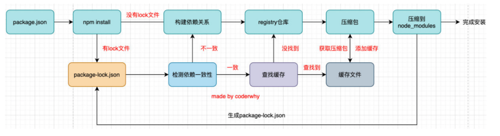

## 包管理工具npm

- 发布自己的包其实是发布到registry上面的
- 安装一个包时其实是从registry上面下载的包；

<!--more-->

### 配置文件属性

- name
- version
- description
- author
- license
- private
  - 记录当前的项目是否是私有的，当值为true时，npm是不能发布它的，这是防止私有项目或模块发布出去的方式
- main
  - 设置程序的入口
  - 这个入口和webpack打包的入口并不冲突
- script
  - 配置一些脚本命令，以键值对的形式存在
- dependencies
  - 指定无论开发环境还是生成环境都需要依赖的包
  - 默认install不加参数，都是生产开发环境都需要依赖的包
- devDependencies
  - 只在开发环境依赖的包
  - `--save-dev`或`-D`
- 版本
  - `^x.y.z`：表示x是保持不变的，y和z永远安装最新的版`~x.y.z`：表示x和y保持不变的，z永远安装最新的版本
- engines属性
  - 用于指定Node和NPM的版本号
- browserslist属性
  - 用于配置打包后的JavaScript浏览器的兼容情况

## 安装

- 全局安装`npm install -g xxx`
- 局部安装`npm install xxx`

全局安装了之后并不能让我们在所有的项目中使用所安装的库，只是命令能全局使用，如`yarn`全局安装。

### 安装过程

## npm命令

- `npm uninstall package`
- `npm uninstall package --save-dev`
- `npm rebuild`
  - 强制重新build
- `npm cache clean`
  - 清除缓存
- `npm config get registry`
  - 查看npm镜像
- `npm config set registry 地址`
  - 修改npm镜像地址

## npx工具

常见的是使用它来调用项目中的某个模块的指令，npx它会到当前目录的node_modules/.bin目录下查找对应的命令
