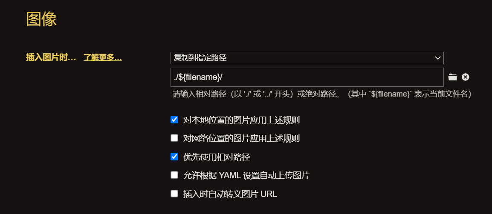
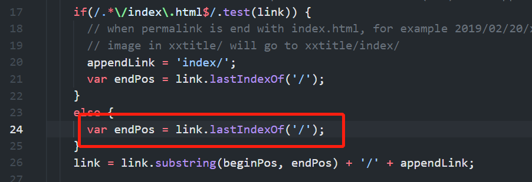

## Hexo 快速搭建

### 环境准备

- git
- node
- npm

<!--more-->

命令行里验证有无安装成功

```bash
$ git --version
git version 2.24.0.windows.1

$ node --version
v14.17.5

$ npm --version
6.14.14
```

#### 配置SSH Key

如果第一次用git工具，记得配置一下SSH key，为部署本地博客到 Github 做准备。

如果之前没有创建，则执行以下命令全局配置一下本地账户：

```bash
git config --global user.name "用户名"
git config --global user.email "邮箱地址"
```

生成密钥SSK key

```bash
ssh-keygen -t rsa -C '上面的邮箱'
```

回车回车回车，即可生成ssh key。`.ssh`目录下有两个文件，`id_rsa`和`id_rsa.pub`，这两个就是ssh key的密钥对，前一个是私钥，后一个是公钥

cat获取你的ssh

```bash
cat ~/.ssh/id_rsa.pub
```

复制输出内容

登录github，settings -> SSH and GPG keys -> New SSH key

Title随便写

Key把刚才复制的内容copy到这，就确认完成了。

### 安装Hexo

执行命令

```bash
$ npm install -g hexo-cli	# -g 代表着全局安装
```

完成后建立自己的个人博客

```bash
$ hexo init blogName
$ cd blogName
$ npm install
```

### 创建你的第一篇博文

新建一篇博文：

```csharp
$ hexo new '新年快乐'
```

在 `/source/_posts`文件夹下找到你的博文，使用typora（推荐）打开并编辑。

保存后运行：

```ruby
$ hexo generate # 生成静态文件，可简写为 hexo g
$ hexo server # 启动服务器。默认情况下，访问网址为：http://localhost:4000/。可以简写为 hexo s
```

此时已经可以在`public`文件夹下看到完整的静态文件。
在浏览器中输入`http://localhost:4000/`就可以看到预览效果了。

以上是本地部署，下面讲博客部署到Github page上

## 部署到Github page

登录github，新建仓库，仓库名为`username.github.io`，**注意：`username`应该是你github的用户名**

本地和github都完成之后，现在需要把这两者连接在一起

1. 修改配置

   在项目根目录下的`_config.yml`修改配置参数

   ```bash
   # Deployment
   ## Docs: https://hexo.io/docs/one-command-deployment
   deploy:
     type: git
     repo:
       github: https://github.com/你的用户名/你的用户名.github.io.git
     branch: master
   ```

   

2. 安装部署插件

   ```shell
   npm install hexo-deployer-git --save
   ```
   `hexo-deploy-git `插件是通过拷贝 `public` 文件夹内容到` .deploy_git `文件夹下，然后提交推送到远程分支上实现了网站文件的部署。

3. 启动执行

   ```shell
   hexo g -d
   ```

 用浏览器输入，https://你的用户名.github.io，就可以看到你的博客了。

## 配置主题

个人用的是[NexT主题](https://theme-next.js.org/)

进入项目根目录，下载NexT主题

```shell
$ git clone https://github.com/next-theme/hexo-theme-next themes/next
```

修改**项目根目录**下的`_config.yml`的配置

注意：`_config.yml`配置文件有两个，一个在项目根目录，一个在`/themes/next`中，大部分配置在主题里面改。

```bash
## Themes: https://hexo.io/themes/
theme: next
```

## NexT配置

以下均在`_config.yml`文件中修改

### 修改NexT风格

NexT主题有四个风格，想要的取消注释

```bash
# Schemes
#scheme: Muse
scheme: Mist
#scheme: Pisces
#scheme: Gemini
```

### 暗黑模式

```bash
# Dark Mode
darkmode: true
```

### 改变网页标签icon

把你想要用的图片放在`/themes/next/source/images`中

```bash
favicon:
  small: /images/favicon-16x16-next.ico
  medium: /images/favicon-32x32-next.ico
```

插一个提示，可以在[比特虫](https://www.bitbug.net/)在线制作icon

### 增加或删除博客页面功能

想用的取消注释，

```bash
menu:
  home: / || fa fa-home
  about: /about/ || fa fa-user
  tags: /tags/ || fa fa-tags
  categories: /categories/ || fa fa-th
  archives: /archives/ || fa fa-archive
  #schedule: /schedule/ || fa fa-calendar
  #sitemap: /sitemap.xml || fa fa-sitemap
  #commonweal: /404/ || fa fa-heartbeat
```

#### 添加标签页面

在项目根目录

```bash
hexo new page tags
cd ./source/tags
```

打开`index.md`文件，增加一个`type`字段

```shell
---
title: tags
type: "tags"
comments: false
date: 2022-01-04 13:29:07
---
```

#### 添加分类页面

在项目根目录

```bash
hexo new page categories
cd ./source/categories
```

打开`index.md`文件，增加一个`type`字段

```shell
---
title: categories
type: "categories"
date: 2022-01-04 13:55:58
---
```

#### 添加about页面

在项目根目录

```bash
hexo new page tags
cd ./source/about
```

打开`index.md`文件，里面直接写你的个人介绍。

### 调整侧边栏位置

```bash
sidebar:
  # Sidebar Position.
  #position: left
  position: right
```

### 添加侧边栏头像图片

```bash
# Sidebar Avatar
avatar:
  # 把要展示的图片放在images中
  url: /images/avatar.jpg
  # If true, the avatar will be displayed in circle.
  rounded: false
  # If true, the avatar will be rotated with the cursor.
  rotated: false
```

### 启用不蒜子统计

不蒜子是用于统计文章添加阅读次数

```bash
busuanzi_count:
  enable: true
  total_visitors: true
  total_visitors_icon: fa fa-user
  total_views: true
  total_views_icon: fa fa-eye
  post_views: true
  post_views_icon: fa fa-eye
```

### 添加加载进度条

```shell
cd themes/next
git clone https://github.com/theme-next/theme-next-pace source/lib/pace
```

修改配置文件 `themes/next/_config.yml`

```bash
pace:
  enable: true
  theme: minimal
```

### 添加页面顶部阅读进度条

```shell
cd themes/next
git clone https://github.com/theme-next/theme-next-reading-progress source/lib/reading_progress
```

修改配置文件 `themes/next/_config.yml`

```bash
reading_progress:
  enable: true
  position: top               # 进度条的位置：top | bottom
  color: "#37c6c0"            # 进度条的颜色
  height: 3px                 # 进度条的大小
```

### 显示侧栏阅读进度百分比

修改配置文件 `themes/next/_config.yml`

```bash
back2top:
  enable: true
  sidebar: false
  scrollpercent: true
```

### 字数与阅读时长统计插件

```cmd
cd 项目根目录
npm install eslint --save
npm install hexo-symbols-count-time --save
```

修改配置文件 `themes/next/_config.yml`

```bash
symbols_count_time:
  time: true                   # 文章阅读时长
  symbols: true                # 文章字数统计
  total_time: true             # 站点总阅读时长
  total_symbols: true          # 站点总字数统计
  exclude_codeblock: true      # 排除代码字数统计

```

### 添加搜索功能

进入项目根目录，下载插件`hexo-generator-searchdb`

```bash
npm install  hexo-generator-searchdb --save
```

修改主题配置文件，添加`search`，并修改`local_search`中的`enable`，改为`true`

```bash
search:
  path: search.xml
  field: post
  format: html
  limit: 10000
  
# Local search
local_search:
  enable: true
```

### 首页博文只展示部分文字

在文章想要分割的位置中添加一行`<!--more-->`

### markdown上使用图片，网页上能正常显示

- 修改根目录下的`_config.yml`文件，把`post_asset_folder`字段改为`true`
  - 改为之后，新建文章时`hexo new 文章标题`，_posts不仅会出现md文件，而且会出现一个同名的**文件夹**，之后这个文件夹放你要引用的图片
- 修改typora设置
  - 以后拖拽图片进文章内之后，图片会自动添加到同名文件夹下面
- 下载插件`npm install hexo-asset-image --save`

根据网上的信息，这时候就`hexo clean && hexo g && hexo s`，按道理就能看到图片了，但结果我的就是不行，图片路径出现了`/.io//*******.png`，就前面会多出`/.io//`这个前缀，导致图片不能显示。

**解决方法**

修改一下项目根目录`/node_modules/hexo-asset-image/index.js`的24行左右，把 `link.lastIndexOf('.')` 修改为 `link.lastIndexOf('/')`就可以了。



## 备份数据

- 修改`.gitignore`文件，添加`package-lock.json` 到忽略清单中

- 创建 `themes_custom/next` 文件夹，将对主题进行的配件修改的文件拷贝一份到这里

  - 例如`_config.yml`文件和source文件中的imag

- 执行以下命令，在本地创建备份仓库
```bash
   cd blog
  $ git init
  已初始化空的 Git 仓库于 blog/.git/
  
  $ git submodule add https://github.com/theme-next/hexo-theme-next.git themes/next
  添加位于 'themes/next' 的现存仓库到索引
  
  $ git add .
  $ git commit -m "init blog backup"
```

- 将备份内容 push 到远程仓库的备份分支 `hexo` 上：

```bash
   git branch -m master hexo
  $ git remote add origin https://github.com/Mupceet/mupceet.github.io.git
  $ git push -u origin hexo:hexo
```

[参考链接](https://mupceet.com/2019/09/backup-hexo-blog)

## Hexo命令

- `hexo init [folder]` 
  - Hexo 默认在目前的文件夹建立网站。
  - Git clone [hexo-starter](https://github.com/hexojs/hexo-starter) 和 [hexo-theme-landscape](https://github.com/hexojs/hexo-theme-landscape) 主题到当前目录或指定目录。
  - 使用 [Yarn 1](https://classic.yarnpkg.com/lang/en/)、[pnpm](https://pnpm.js.org/) 或 [npm](https://docs.npmjs.com/cli/install) 包管理器下载依赖（如有已安装多个，则列在前面的优先）。npm 默认随 [Node.js](https://hexo.io/docs/#Install-Node-js) 安装。
- `hexo new '文章标题'`
  - 新建文件，写的时候自己用typora打开写
- `hexo clean`
  - 清除缓存文件 (`db.json`) 和已生成的静态文件 (`public`)。
  - 在某些情况（尤其是更换主题后），如果发现您对站点的更改无论如何也不生效，您可能需要运行该命令。
- `hexo generate`
  - 生成静态文件，可简写为`hexo g`
- `hexo server`
  - 启动服务器。默认情况下，访问网址为：`http://localhost:4000/`。可以简写为 hexo s
- `hexo deploy`
  - 部署网站，可简写为`hexo d`

