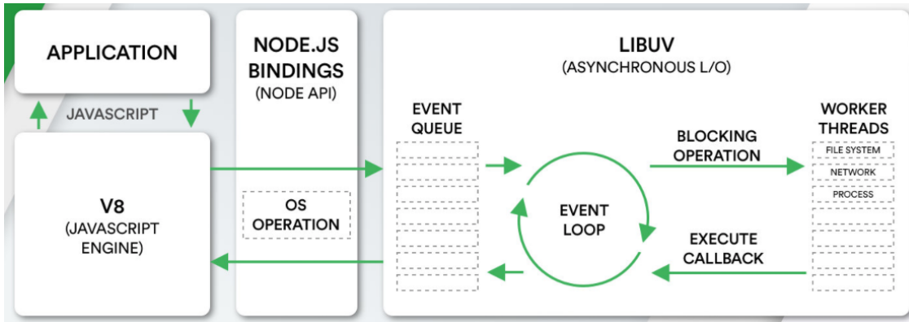
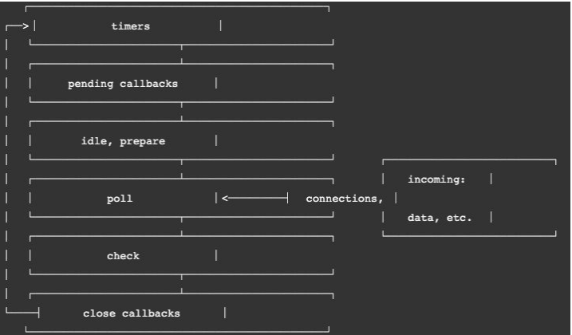

> 事件循环理解成我们编写的JavaScript和浏览器或者Node之间的一个桥梁
>
> - 浏览器的事件循环是一个我们编写的JavaScript代码和浏览器API调用(setTimeout/AJAX/监听事件等)的一个桥梁,桥梁之间他们通过回调函数进行沟通
> - Node的事件循环是一个我们编写的JavaScript代码和系统调用（filesystem、network等）之间的一个桥梁,桥梁之间他们通过回调函数进行沟通的.

JavaScript的代码执行是在一个单独的线程中执行

<!--more-->

## 浏览器的事件循环

三个主要概念

- 执行栈
- 宏任务队列
  - ajax、setTimeout、setInterval、DOM监听、UIRendering等
- 微任务队列
  - Promise的then回调、MutationObserverAPI、queueMicrotask()等

### 执行流程

1. **JS引擎**（唯一主线程）按顺序解析代码，遇到函数声明，直接跳过，遇到函数调用，入栈；
2. 如果是同步函数调用，直接执行得到结果，同步函数弹出栈，继续下一个函数调用；
3. 如果是异步函数调用，分发给**WebAPI**（多个辅助线程），异步函数弹出栈，继续下一个函数调用；
4. WebAPI中，异步函数在相应辅助线程中处理完成后，即异步函数达到触发条件了（比如setTimeout设置的10s后），如果异步函数是宏任务，则入宏任务**消息队列**，如果是微任务，则入微任务消息队列；
5. **EventLoop**不停地检查主线程的调用栈与回调队列，当调用栈空时，就把微任务消息队列中的第一个任务推入栈中执行，执行完成后，再取第二个微任务，**直到微任务消息队列为空**；然后
   去宏任务消息队列中取第一个宏任务推入栈中执行，当该宏任务执行完成后，在下一个宏任务执行前，再依次取出微任务消息队列中的所有微任务入栈执行。
6. 上述过程不断循环，每当微任务队列清空，可作为本轮事件循环的结束。

## Node架构分析

- libuv中主要维护了一个EventLoop和workerthreads（线程池）
  - 线程池会负责所有相关的操作，并且会通过轮训等方式等待结果
  - 当获取到结果时，就可以将对应的回调放到事件循环（某一个事件队列）中
  - 事件循环就可以负责接管后续的回调工作，告知JavaScript应用程序执行对应的回调函数
- EventLoop负责调用系统的一些其他操作：文件的IO、Network、child-processes

## 阻塞式调用与非阻塞式调用区别

- 阻塞式调用：调用结果返回之前，当前线程处于阻塞态（阻塞态CPU是不会分配时间片的），调用线程只有在得到调用结果之后才会继续执行
- 非阻塞式调用：调用执行之后，当前线程不会停止执行，只需要过一段时间来检查一下有没有结果返回即可

## Node事件循环

1. 定时器（Timers）：本阶段执行已经被setTimeout()和setInterval()的调度回调函数
2. 待定回调（PendingCallback）：对某些系统操作（如TCP错误类型）执行回调，比如TCP连接时接收到ECONNREFUSED
3. idle,prepare：仅系统内部使用
4. 轮询（Poll）：检索新的I/O事件；执行与I/O相关的回调
5. 检测：setImmediate()回调函数在这里执行
6. 关闭的回调函数：一些关闭的回调函数，如：socket.on('close',...)

Node同样也有宏任务微任务队列

- 宏任务：setTimeout、setInterval、IO事件、setImmediate、close事件
- 微任务：Promise的then回调、process.nextTick、queueMicrotask
